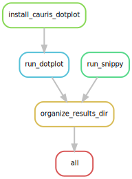

# Strain validation
Snakemake pipeline to validate mutants made in the lab

## Summary
This pipeline performs two  steps:
- Firstly, it creates synteny dot plots using long reads based on an in house pipeline [cauris_dotplot](https://github.com/Snitkin-Lab-Umich/cauris_dotplot_pipeline) 
- Secondly, it runs [snippy](https://github.com/tseemann/snippy), a variant calling tool, that takes paired end reads and a reference genome.

The workflow generates all the output in the `prefix` folder set in  `config/config.yaml`. Each workflow steps gets its own individual folder as shown below. This structure provides a general view of how outputs are organized, with each tool or workflow step having its own directory. **_Note that this overview does not capture all possible outputs from each tool; it only highlights the primary directories and _SOME_ of their contents._** 

**The synteny plots and variant information can be found in the `final_results` folder.**

```
results/2025-06-03_Test_Strain_Validation_Pipeline/
├── cauris_dotplot_repo
│   ├── dotplot.py
│   ├── highlight_data.tsv
│   ├── make_plots.R
│   ├── README.md
│   ├── run_dotplot.job
│   └── sloop.py
├── dotplots
│   └── MI_KPC_112_C
│       ├── contig_data
│       │   ├── MI_KPC_112_C_contig_data.csv
│       │   └── MI_KPC_112_flye_medaka_polypolish_contig_data.csv
│       ├── MI_KPC_112_C_debug_log.txt
│       ├── nucmer
│       │   ├── MI_KPC_112_C.coord
│       │   └── MI_KPC_112_C.delta
│       └── plots
├── final_results
│   ├── MI_KPC_112_C.csv
│   └── MI_KPC_112_C.pdf
└── snippy
    └── MI_KPC_112_C
        ├── MI_KPC_112_C.aligned.fa
        ├── MI_KPC_112_C.bam
        ├── MI_KPC_112_C.filt.vcf
        ├── MI_KPC_112_C.gff
        ├── MI_KPC_112_C.html
        ├── MI_KPC_112_C.log
        ├── MI_KPC_112_C.raw.vcf
        ├── MI_KPC_112_C.subs.vcf
        ├── MI_KPC_112_C.tab
        ├── MI_KPC_112_C.txt
        ├── MI_KPC_112_C.vcf
        ├── MI_KPC_112_C.vcf.gz
        ├── MI_KPC_112_C.vcf.gz.csi
        ├── reference
        ├── ref.fa -> reference/ref.fa
        └── ref.fa.fai -> reference/ref.fa.fai
```

## Installation

>If you are using Great Lakes HPC, ensure you are cloning the repository in your scratch directory. Change `your_uniqname` to your uniqname.

```
cd /scratch/esnitkin_root/esnitkin1/your_uniqname/
```

> Clone the github directory onto your system.

```

git clone https://github.com/Snitkin-Lab-Umich/strain_validation.git

```

> Ensure you have successfully cloned `strain_validation`. Type `ls` and you should see the newly created directory **_strain_validation_**. Move to the newly created directory.

```

cd strain_validation

```
> To ensure a clean starting environment, deactivate and/or remove any modules/packages loaded.

```
module purge
conda deactivate
```

> Load bioinformatics, snakemake, singularity and R modules from Great Lakes modules.

```

module load Bioinformatics snakemake singularity R

```

Check to see if you have ggplot2 installed in your home directory 

> Open an R session by typing the below command on the terminal.

```
R
```
> Once you open an R session, load the ggplot2 library

```
library(ggplot2)
```

If you do not see any message(s) show up after loading the library, that means you have it installed in your home, quit the session `q()` and skip to this [section](#setup-config-and-samples-files). However if you see this message `Error in library(ggplot2) : There is no package called 'ggplot2'`, you have to install it in your home directory manually with this command. 

```
install.packages("ggplot2", repos = "https://repo.miserver.it.umich.edu/cran/")
```

>Check to see if the installation worked by running this command

```
library(ggplot2)
```

Quit the R session `q()` after successful installation of `ggplot2` and move onto the next section of the pipeline.  

## Setup config, sample and cluster files

**_If you are just testing this pipeline, the config and sample files are already loaded with test data, so you do not need to make any additional changes to them. However, it is a good idea to change the prefix (name of your output folder) in the config file to give you an idea of what variables need to be modified when running your own samples._**

### Customize config.yaml and set tool specific parameters
As an input, the snakemake file takes a config file where you can set the path to `sample_sheet.csv`, path to ONT long reads and illumina short reads, etc. Instructions on how to modify `config/config.yaml` is found in `config.yaml`. 

### Samples
This sample file should contain 6 columns: `Reference_genome`, `Reference_genome_path`, `Sample_name`,  `Illumina_F`, `Illumina_R` and `ONT_assembly`. An example of how the `sample_sheet.csv` should look like can be found here `/nfs/turbo/umms-esnitkin/Project_MIDGE_Bac/Analysis/Plasmid_curing/2025-04-16_EXAMPLE_CURING_EXP/sample_sheet.csv`. 

To create the `sample_sheet.csv`, you need to run `generate_sample_sheet.py`.

Couple of assumption before you run the aforementioned python script.
- If you run `generate_sample_sheet.py` in a `--dryrun` mode, you should be able to see which files are being moved, where it is being moved and if there are any missing sequencing data.
- You will be running `generate_sample_sheet.py` from the `Plasmid_curing` directory i.e. here `/nfs/turbo/umms-esnitkin/Project_MIDGE_Bac/Analysis/Plasmid_curing/`
- `sample_sheet.csv` will be created in the `Plasmid_curing` directory. 
- `ONT_assemblies/` and `illumina_reads/` already exist here `/nfs/turbo/umms-esnitkin/Project_MIDGE_Bac/Analysis/Plasmid_curing/`
- `/nfs/turbo/umms-esnitkin/Project_MIDGE_Bac/Analysis/Plasmid_curing/Plasmidsaurus_data/` contains all ONT & Illumina data (`*_results`, `*_Illumina_fastq` where `*` is **plasmidsaurus BATCH NAME**).
- File names `/nfs/turbo/umms-esnitkin/Project_MIDGE_Bac/Analysis/Plasmid_curing/Plasmidsaurus_data/2025-05-20_curing_batch_1_sample_lookup.csv` and `/nfs/turbo/umms-esnitkin/Project_MIDGE_Bac/Analysis/Plasmid_curing/MDHHS_hybrid_genome_assembly_paths.txt` are not altered—otherwise, the script will break.

Once you have read the above expectations, copy paste the command below on your terminal to create `sample_sheet.csv`. Replace `your_uniqname` with your uniqname.

```
cd /nfs/turbo/umms-esnitkin/Project_MIDGE_Bac/Analysis/Plasmid_curing/

python3 /scratch/esnitkin_root/esnitkin1/your_uniqname/generate_sample_sheet.py
```

### Cluster file
Change the walltime according to the number of samples you have in `config/cluster.json` to ensure the jobs are being submitted in a timely manner. Update `email` flag to your email.

## Quick start

### Run pipeline on a set of samples.

>Preview the steps in Strain validation by performing a dryrun of the pipeline.

```

snakemake -s workflow/Snakefile --dryrun

```

> Submit the pipeline as a batch job. Change these SBATCH commands: `--job-name` to a more descriptive name like `run_strainval`, `--mail-user` to your email address, `--time` depending on the number of samples you have (should be more than what you specified in `config/cluster.json`). Feel free to make changes to the other flags if you are comfortable doing so. The sbat script can be found in the current directory—it's called `StrainValidation.sbat`. Don't forget to submit the script to Slurm! `sbatch StrainValidation.sbat`.

```
#!/bin/bash

#SBATCH --job-name=strain_val
#SBATCH --mail-user=youremail@umich.edu
#SBATCH --mail-type=BEGIN,END,FAIL,REQUEUE
#SBATCH --export=ALL
#SBATCH --partition=standard
#SBATCH --account=esnitkin1
#SBATCH --nodes=1 --ntasks=1 --cpus-per-task=3 --mem=10g --time=08:15:00

# Load necessary modules
module load Bioinformatics snakemake singularity R mummer/4.0.0rc1 Rtidyverse/4.4.3

# Run pipeline
snakemake -s workflow/Snakefile --use-envmodules -j 999 --cluster "sbatch -A {cluster.account} -p {cluster.partition} -N {cluster.nodes}  -t {cluster.walltime} -c {cluster.procs} --mem-per-cpu {cluster.pmem} --output=slurm_out/slurm-%j.out" --cluster-config config/cluster.json --configfile config/config.yaml --latency-wait 100 --nolock
```

## DAG of pipeline


## Dependencies

### Near Essential
* [Snakemake>=7.32.4](https://snakemake.readthedocs.io/en/stable/#)

### Tool stack used in workflow

* [R](https://www.r-project.org/)
* [snippy](https://github.com/tseemann/snippy)
* [nucmer](https://github.com/mummer4/mummer)
* [Pandas](https://pandas.pydata.org/)

